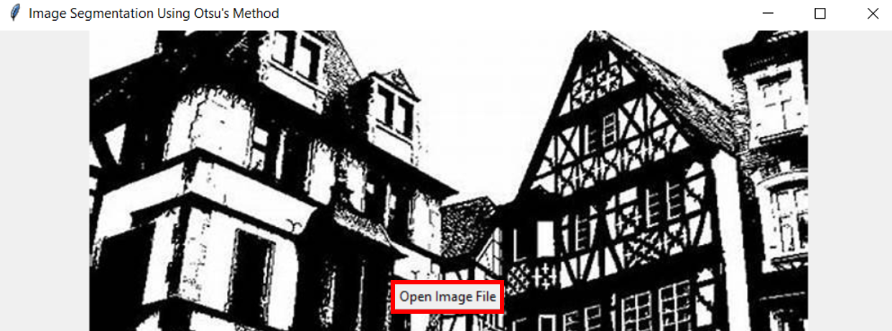
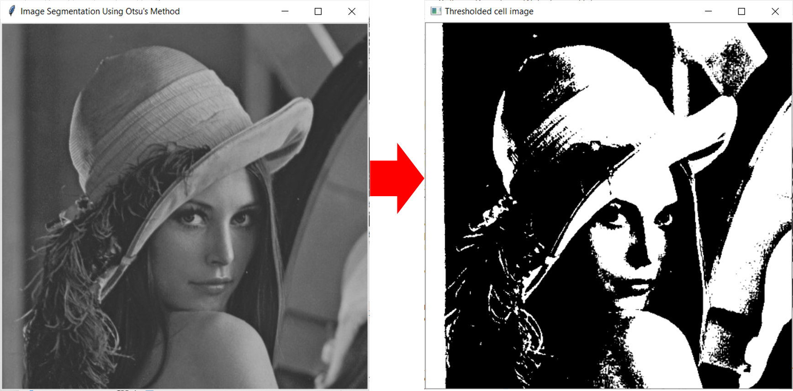

# Otsu_Segmentation_with_Python_Tkinter

### Perform Otsu's segmentation (assumes histograms are bimodal) with Tkinter Package

### GUI 

### From Grayscale to Segmented Image

###  Plot Histograms of the Orignal Grayscale Image and the Output Segmented Image Simultaniously

